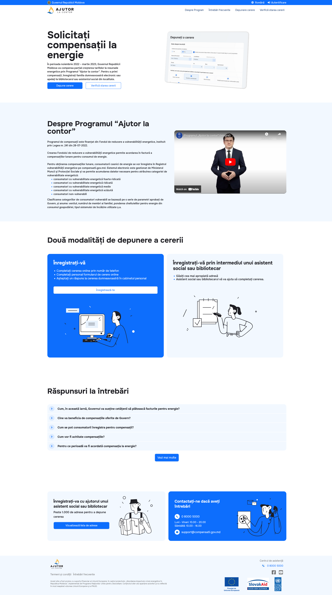

# A [compensatii.gov.md](https://compensatii.gov.md/) landing page clone

Preview


This is a [Next.js](https://nextjs.org/) project bootstrapped with [`create-next-app`](https://github.com/vercel/next.js/tree/canary/packages/create-next-app).

# Instructions to run

Git clone and cd into the project:

```bash
git clone https://github.com/stefandev15/compensatii.gov.md-clone.git
cd compensatii.gov.md-clone
```

Run the development server:

```bash
npm run dev
# or
yarn dev
# or
pnpm dev
```

Open [http://localhost:3000](http://localhost:3000) with your browser to see the result.
